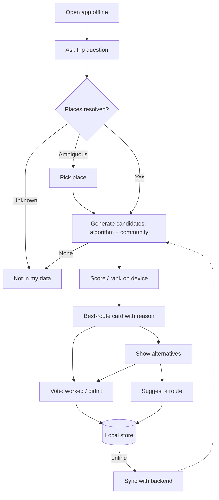

# Product Requirements: CommuteNity

**Project:** CommuteNity
**Date:** 2026-10-09
**Version:** 0.2
**Owner:** Project owner
**Status:** Draft
**Last reconciled:** 2026-10-09
**IDEA:** [Idea brief](idea-commutenity.md) · **Scope:** [MVP scope](mvp-scope.md) · **Stories:** [User stories](user-stories.md)

## 1. Purpose

CommuteNity is a native Android app. It helps a rider who doesn't know a Metro Manila trip get the most efficient route, explained in plain language: legs, where to board, where to alight, fares, and time. It works **without network access** at the moment of use.

On request, the app shows alternative routes that come from the routing algorithm and from other riders. Riders can contribute routes and votes, which improve future picks. All AI runs on the phone. Every fact in an answer comes from the curated commute pack or a validated contribution.

## 2. Personas

- **Primary:** New Arrival.
- **Secondary:** Occasional Commuter, and the Daily Rider (who is also the main contributor).

Definitions: [IDEA §2](idea-commutenity.md#2-who-its-for). These are target roles, not interviewed customers ([VALIDATION](val-commutenity.md)).

## 3. Features and Priorities

| ID | Feature | Description | Priority | Tier |
|---|---|---|---|---|
| PRD-F1 | Trip question understanding | An on-device LLM turns a Taglish or English question into a structured origin, destination, and preference. Ambiguous places trigger a choice. | Must | T0 |
| PRD-F2 | Auto route picker and grounded answer | Deterministic candidate generation over the pack, a hand-weighted efficiency score, and an auto-picked best route. The on-device LLM phrases it without adding facts. A reason line explains the pick. Out-of-coverage questions get "not in my data". | Must | T0 |
| PRD-F3 | On-device commute pack | Curated stops, places and aliases, routes, segments, fares, minutes, and signboard texts, stored on the phone. Every record is classed `collected`, `known`, or `mock`, and mock values are marked in the UI. | Must | T0 |
| PRD-F4 | First-run setup and offline shell | One-time model download with progress. Works fully offline afterwards. | Must | T1 |
| PRD-F5 | Alternatives on request | Other ranked candidates, labelled Algorithm or Community, with reason lines and vote counts | Must | T1 |
| PRD-F6 | Community contributions with local-first sync | Suggest a route (structured legs plus a note) and vote "this worked / didn't". Stored locally and synced through the secondary backend when online. | Must | T1 |
| PRD-F7 | Learned on-device ranker | A model trained on preference labels and votes replaces the hand-weighted score if it wins on held-out data | Should | T2 |
| PRD-F8 | Signboard check | Camera → on-device OCR → deterministic match against the trip's legs | Could | T3 |
| PRD-F9 | Voice question | On-device speech-to-text feeding PRD-F1 | Could | T4 |
| PRD-F10 | Full social layer, browser app, iOS | Parked | Won't (this event) | — |

## 4. Stories and Acceptance Criteria

These are owned by [user stories](user-stories.md):
- US-01 to US-03 (T0)
- US-04 to US-08 (T1)
- US-09 (T2)
- US-10 (T3)
- US-11 (T4)

## 5. App Flow and UX Intent

Design reference: [DSD](dsd-commutenity.md).

| Surface | Entry | Loading | Empty | Error | Success |
|---|---|---|---|---|---|
| First-run setup | First launch on a network | Download progress (size, %) | — | Download failed, retry. Never shown as ready when partial. | "Ready offline", plus storage used |
| Ask | Home | "Nag-iisip sa phone mo…" | Example questions for covered corridors | Model failed to load, retry | Best-route card |
| Best-route card | After asking | — | "Not in my data", plus the covered areas | Lookup failed, rephrase | Legs, fares, minutes, para point, reason line, on-device badge |
| Place picker | Ambiguous place | — | — | — | Place chosen; the flow continues |
| Alternatives sheet | "Show alternatives" | — | "No other routes yet. Suggest one?" | — | Ranked list with Algorithm/Community labels and votes |
| Suggest route | From the card or alternatives | — | — | Invalid leg, with the reason | "Saved on your phone · will sync" |
| Vote | On any route | — | — | — | Vote state shown; unsynced marker |
| Sync status | Top bar | Syncing | Nothing to sync | Offline or failed; retries later | Synced, with a timestamp |
| Signboard check (T3) | From a leg | "Reading sign…" | — | "Can't read it, try again" | Text read, plus "ride this" or "wrong jeep" |
| Voice (T4) | Mic button | Listening, then transcribing | — | Mic denied or nothing heard | Transcript fills Ask |

Primary path: open → ask → (pick place) → best-route card → (show alternatives) → (vote / suggest) → sync later.

The app has no accounts. Contributions carry an anonymous device ID ([A9](state.md#4-open-assumptions)).

### 5.6 Instrumentation

These events are logged on the phone only, for the demo and for evals. The only data that leaves the phone is the contributions themselves, through sync.

| Event | Trigger | Properties | Metric |
|---|---|---|---|
| `question_parsed` | Parser returns | Latency ms, ok/fail, ambiguity flag | Parse success, latency |
| `route_picked` | Best-route card renders | Candidate count, source of the pick, scorer (baseline/ranker), total latency ms | End-to-end latency, coverage |
| `alternatives_opened` | Sheet opens | Count by source | Use of alternatives |
| `contribution_saved` | Suggestion or vote stored | Type, synced flag | Contribution volume |
| `sync_completed` | Sync ends | Up/down counts, ms, ok/fail | Sync reliability |
| `model_loaded` | Model ready | Model ID, load ms | Cold vs warm start |

## 6. Cut Line

Tiers are built strictly in order ([MVP scope](mvp-scope.md#tiers)). Nothing from T2 or later merges into the demo build before T1 is demo-safe. Ranker data collection and training run in parallel but stay off the demo path until they beat the baseline.

## 7. AI Behavior

All inference runs on the phone ([SDD §8](sdd-commutenity.md#8-ai-architecture-and-safety)).

- **Parser (PRD-F1):** returns JSON matching the [parser contract](sdd-commutenity.md#4-module-contracts), at low temperature. On invalid output it retries once, then asks the user to rephrase.
- **Route pick (PRD-F2, PRD-F7):** candidates come only from the deterministic generator and from validated community suggestions. The scorer or ranker only orders them; it never creates routes or facts.
- **Phrasing (PRD-F2):** input is the structured picked route. Output is a short Taglish or English answer. If the phrasing adds any number or place not in `factsUsed`, the app shows the template instead.
- **Signboard (PRD-F8):** OCR text goes to a deterministic fuzzy match against the legs' signboard variants. The model never decides "ride this" alone.
- **Speech (PRD-F9):** the transcript is shown for confirmation before parsing.
- **No cloud fallback** for any of these.

## 8. Dependencies

- An Android demo phone that can run the chosen LLM ([A4](state.md#4-open-assumptions), [A12](state.md#4-open-assumptions)).
- Open-weight models packaged for Android runtimes.
- A curated pack with fares and minutes ([data plan](data-commutenity.md)).
- A sync backend ([A9](state.md#4-open-assumptions)).
- Screen mirroring for the stage demo.

## 9. Implementation and Rollback

| Stage | Entry | Exit | Owner |
|---|---|---|---|
| Specify / Shape | Docs and wayfinder map | A4, A6, A8, A12 decided | Project owner |
| T0 skeleton | Decisions made | US-01 to US-03 pass offline on the demo phone | Android owner and AI owner |
| T1 demo-ready | T0 passes | QAD gate for T0+T1 | Whole team |
| T2 ranker | Eval beats baseline | Ranker swapped in; eval recorded | Ranker owner |
| T3/T4 | Previous tier gate | US-10 / US-11 pass | Feature owners |
| Freeze and submit | 8:00 AM feature freeze | Submitted before 10:00 AM | Project owner |

**Rollback trigger:** any regression in the offline T0/T1 path, a wrong fact during rehearsal, or a sync failure that blocks the UI. Action: install the last `demo-safe-*` APK ([BUILD §5](build-commutenity.md#5-conventions-and-definition-of-done)) and turn off the failing tier's feature flag.
