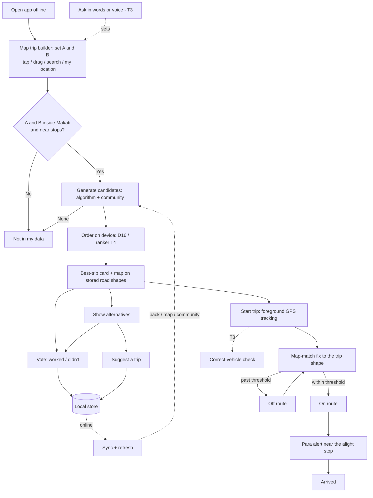

# Product Requirements: CommuteNity

**Project:** CommuteNity
**Date:** 2026-10-09
**Version:** 0.3
**Owner:** Project owner
**Status:** Draft. Re-scoped to Makati City only, with a map-first trip builder ([D20](state.md#5-decisions) to [D29](state.md#5-decisions)).
**Last reconciled:** 2026-10-09
**IDEA:** [Idea brief](idea-commutenity.md) · **Scope:** [MVP scope](mvp-scope.md) · **Stories:** [User stories](user-stories.md)

## 1. Purpose

CommuteNity is a native Android app. It helps a rider who doesn't know a trip in **Makati City** get the most efficient route, shown on a map and explained in plain language: legs, where to board, where to alight, fares, minutes, distance, walk time, and where to say "para". The rider sets point A and point B on a map ([D21](state.md#5-decisions)). The route is drawn along real roads from shapes stored in the pack ([D22](state.md#5-decisions)).

The app works **without network access** at the moment of use, including the map and in-trip tracking ([D23](state.md#5-decisions), [D25](state.md#5-decisions)). When online, it refreshes its pack, map, and community data ([D24](state.md#5-decisions)).

On request, the app shows alternative routes that come from the routing algorithm and from other riders. Riders can contribute routes and votes, which improve future picks. During a trip, the phone's GPS tells the rider whether they are still on route and warns them before their alight stop. All AI runs on the phone. Every fact in an answer comes from the curated commute pack or a validated contribution.

## 2. Personas

- **Primary:** New Arrival.
- **Secondary:** Occasional Commuter, and the Daily Rider (who is also the main contributor).

Definitions: [IDEA §2](idea-commutenity.md#2-who-its-for). These are target roles, not interviewed customers ([VALIDATION](val-commutenity.md)).

## 3. Features and Priorities

| ID | Feature | Description | Priority | Tier |
|---|---|---|---|---|
| PRD-F1 | Map trip builder | Set point A and point B on the map: tap, drag a pin, search pack places, or "use my location" for A. Online geocoding through our server is an extra when a connection exists. Works offline. | Must | T0 |
| PRD-F2 | Best-trip computation and road-following display | Candidates (algorithm, community, mock-tagged) go through the [D16](state.md#5-decisions) ordering. The best trip shows legs, fares, minutes, distance, walk time, para point, and a reason line, drawn on stored road shapes. Out-of-coverage trips get "not in my data". | Must | T0 |
| PRD-F3 | On-device commute pack and offline Makati map | Curated stops, places and aliases, routes, segments with road shapes, fares, minutes, distances, and signboard texts, stored on the phone, plus the offline Makati map pack. Every record is classed `collected`, `known`, or `mock`, and mock values are marked in the UI. | Must | T0 |
| PRD-F4 | Online refresh and cache | When online, fetch and cache the latest pack, map pack, community suggestions and vote aggregates, and first/last-mile foot routes. Shows status. Nothing on the answer path needs it. | Must | T1 |
| PRD-F5 | Alternatives on request | Other ranked candidates, labelled Algorithm or Community, with reason lines and vote counts | Must | T1 |
| PRD-F6 | Community contributions with local-first sync | Suggest a trip (structured legs plus a note) and vote "this worked / didn't". Stored locally and synced through the secondary backend when online ([D17](state.md#5-decisions)). | Must | T1 |
| PRD-F7 | In-trip tracking | Offline GPS snapped to the active trip's shape: on-route or off-route status, current leg, distance and stops to the para point, and a para alert before the alight stop. | Must | T2 |
| PRD-F8 | Ask in words | An on-device LLM turns "How to get from X to Y?" into point A and point B, and turns "Is this the correct vehicle?" into the correct-vehicle check ([D27](state.md#5-decisions)). Phrasing stays grounded in the computed trip. | Should | T3 |
| PRD-F9 | Voice questions | On-device speech-to-text (Whisper) feeding PRD-F8 | Should | T3 |
| PRD-F10 | Learned on-device ranker | A model trained on preference labels and votes replaces the deterministic baseline if it wins on held-out data ([D11](state.md#5-decisions), [D18](state.md#5-decisions)) | Could | T4 |
| PRD-F11 | OCR signboard scan, TTS, full social layer, browser app, iOS, coverage beyond Makati | Parked ([D26](state.md#5-decisions), [D20](state.md#5-decisions)) | Won't (this event) | — |

## 4. Stories and Acceptance Criteria

These are owned by [user stories](user-stories.md):
- US-01 to US-03 (T0)
- US-04 to US-08 (T1)
- US-09 and US-10 (T2)
- US-11 to US-13 (T3)
- US-14 (T4)

## 5. App Flow and UX Intent

Design reference: [DSD](dsd-commutenity.md). The map is the home screen; the trip is a map object, not a chat reply.

| Surface | Entry | Loading | Empty | Error | Success |
|---|---|---|---|---|---|
| First run (pack and map) | First launch. The bundled pack always works; the map pack is bundled or downloaded once ([D23](state.md#5-decisions)). | Download progress (size, %) if the map is downloaded | — | Download failed, retry. Never shown as ready when partial. | "Ready offline", plus storage used and "data as of …" |
| Map trip builder | Home | Map tiles from the local map pack | Map centred on Makati, hint "Tap to set A, then B" | Map pack missing or unreadable: retry or re-download. Location denied: pin by tap or search instead. | Pins A and B set, with labels; trip computed |
| Place search | Search field in the builder | — | Suggestions from pack places and aliases | No match: "Not in my data". Online geocoding unavailable: pack places only. | Pin placed at the place |
| Best-trip card and map | After A and B are set | "Hinahanap ang ruta…" | "Not in my data" (outside Makati or no route), plus the covered area | Lookup failed, adjust the pins | Legs on the map along real roads, fares, minutes, distance, walk time, para point, reason line, on-device badge. Mock values marked. An offline first/last-mile walk is a dashed line labelled "walk ~N m". |
| Alternatives sheet | "Show alternatives" | — | "No other trips yet. Suggest one?" | — | Ranked list with Algorithm/Community labels and votes; picking one redraws the map |
| Suggest trip | From the card or alternatives | — | — | Invalid leg, with the reason | "Saved on your phone · will sync" |
| Vote | On any trip | — | — | — | Vote state shown; unsynced marker |
| Refresh and sync status | Top bar | Refreshing or syncing | Nothing new | Offline or failed; the app keeps working on cached data and retries later | "Updated" or "Synced", with a timestamp and the pack and map versions |
| Active trip (tracking) | "Start trip" on the best-trip card | "Naghahanap ng GPS…" | — | GPS unavailable or permission denied: trip stays viewable without tracking; GPS lost mid-trip shows the last known status as stale | Position on the route, "On route", current leg, distance and stops to the para point, ongoing notification |
| Off route | Tracking sees a deviation past the threshold | — | — | — | "You may be off route" with distance from the route; clears when the rider returns |
| Para alert | ~300 m before the alight stop ([D25](state.md#5-decisions)) | — | — | — | Vibration, heads-up notification, and an on-screen banner "Para na sa <stop>". Fires once per alight point. No sound. |
| Ask in words (T3) | Text field or mic on the map | "Nag-iisip sa phone mo…" | Example questions for Makati | Model failed to load or not understood: use the map instead | Point A and point B set; the flow continues in the builder |
| Correct-vehicle check (T3) | From a leg of the active trip, or asked in words | "Checking…" | — | Nothing typed or recognised: "Type the signboard text" | Shows the text read and "Yes, ride this", "No, look for '<signboard>'", or "Not sure, check the signboard" ([D27](state.md#5-decisions)) |
| Voice (T3) | Mic button | Listening, then transcribing | — | Mic denied or nothing heard | Transcript shown for confirmation, then fills Ask |

Primary path: open → set A and B on the map → best-trip card and map → (show alternatives) → (vote / suggest) → (start trip → on route → para alert) → sync and refresh whenever online.

The app has no user-facing accounts. Contributions use an internal anonymous Auth identity and sync through the server-side validation boundary ([D17](state.md#5-decisions)). GPS tracks never leave the phone ([SDD §5](sdd-commutenity.md#5-security-and-privacy)).

### 5.6 Instrumentation

These events are logged on the phone only, for the demo and for evals. They never carry coordinates. The only data that leaves the phone is the contributions themselves, through sync, plus the requests listed in [SDD §5](sdd-commutenity.md#5-security-and-privacy).

| Event | Trigger | Properties | Metric |
|---|---|---|---|
| `question_parsed` | LLM parser returns (T3) | Latency ms, ok/fail, ambiguity flag | Parse success, latency |
| `route_picked` | Best-trip card renders | Candidate count, source of the pick, scorer (baseline/ranker), total latency ms | End-to-end latency, coverage |
| `alternatives_opened` | Sheet opens | Count by source | Use of alternatives |
| `contribution_saved` | Suggestion or vote stored | Type, synced flag | Contribution volume |
| `sync_completed` | Sync ends | Up/down counts, ms, ok/fail | Sync reliability |
| `refresh_completed` | Refresh ends | Pack and map updated flags, bytes, ms, ok/fail | Refresh reliability |
| `trip_started` | "Start trip" tapped | Source of the trip, leg count, GPS provider | Tracking use |
| `off_route` | Off-route state entered | Leg index, max distance from the route (m), duration (s) | Threshold tuning ([A16](state.md#4-open-assumptions)) |
| `para_alert_fired` | Para alert fires | Leg index, distance to the para point at fire (m), GPS accuracy (m) | Alert reliability: fires once, at the right place |
| `model_loaded` | Model ready (T3) | Model ID, load ms | Cold vs warm start |

## 6. Cut Line

Tiers are built strictly in order ([MVP scope](mvp-scope.md#tiers)). The MVP is T0 + T1 + T2. Nothing from T3 or later merges into the demo build before T2 is demo-safe. LLM, STT, and ranker work starts early in parallel but stays off the demo path until its tier. The ranker also stays off until it beats the baseline. Cut rules: [BUILD §1](build-commutenity.md#1-build-sequence).

## 7. AI Behavior

All inference runs on the phone ([SDD §8](sdd-commutenity.md#8-ai-architecture-and-safety)). T0 to T2 need no model: the trip, reason line, tracking, and para alert come from deterministic code and templates.

- **LLM parse (PRD-F8, T3):** returns JSON matching the [parser contract](sdd-commutenity.md#4-module-contracts), at low temperature. It does one of two things: extract an origin and destination (and optional preference) from a question, or extract the signboard or route-name text from a vehicle question. On invalid output it retries once, then asks the rider to rephrase or use the map. Extracted places still go through place search before pins are set.
- **Trip pick (PRD-F2, PRD-F10):** candidates come only from the deterministic generator and from validated community suggestions. The scorer or ranker only orders them; it never creates routes or facts.
- **Phrasing (PRD-F8):** input is the structured best trip. Output is a short Taglish or English answer. If the phrasing adds any number or place not in `factsUsed`, the app shows the template instead.
- **Correct-vehicle check (PRD-F8, [D27](state.md#5-decisions)):** the verdict is a deterministic fuzzy match of the typed or spoken text against the active trip's `routes.signboards[]` and route names. The LLM only extracts the text; it never decides "ride this".
- **Speech (PRD-F9):** Whisper transcribes on the phone. The transcript is shown for confirmation before parsing.
- **No OCR, no TTS** ([D26](state.md#5-decisions)).
- **No cloud fallback** for any of these.

## 8. Dependencies

- An Android demo phone that can run the chosen LLM and Whisper ([A4](state.md#4-open-assumptions), [A12](state.md#4-open-assumptions)); gates T3 only.
- A Makati map pack that MapLibre Native Android renders offline ([A14](state.md#4-open-assumptions)).
- A Makati hero trip with at least two genuinely different trips ([A13](state.md#4-open-assumptions)).
- A shape-routing engine for the data build ([A15](state.md#4-open-assumptions)).
- A curated pack with fares, minutes, distances, and road shapes ([data plan](data-commutenity.md)).
- GPS accuracy good enough in Makati for the off-route and para thresholds ([A16](state.md#4-open-assumptions)).
- Location and notification permissions granted on the demo phone.
- The Supabase boundary for sync and refresh ([D17](state.md#5-decisions), [D24](state.md#5-decisions)).
- Screen mirroring for the stage demo.

## 9. Implementation and Rollback

| Stage | Entry | Exit | Owner |
|---|---|---|---|
| Specify / Shape | Docs and wayfinder map | D20 to D29 recorded; A13 to A15 closed before their checkpoints | Project owner |
| T0 skeleton | CP1 map spike passes; pack v0 with shapes | US-01 to US-03 pass offline on the demo phone | P1, P3, P4 |
| T1 demo-ready | T0 passes | US-04 to US-08 pass; [QAD gate](qad-commutenity.md#6-release-criteria) for T0 + T1 | Whole team |
| T2 tracking | T1 demo-safe | US-09 and US-10 pass, including the mock-location GPS track | P1, P3 |
| T3 ask in words and voice | T2 demo-safe; LLM speed test passed | US-11 to US-13 pass | P2 |
| T4 ranker | Eval beats baseline | Ranker swapped in; eval recorded | P3 |
| Freeze and submit | 8:00 AM feature freeze | Submitted before 10:00 AM | Project owner |

**Rollback trigger:** any regression in the offline T0/T1/T2 path, a wrong fact during rehearsal, a para alert that fires at the wrong place or more than once, or a refresh or sync failure that blocks the UI. Action: install the last `demo-safe-*` APK ([BUILD §5](build-commutenity.md#5-conventions-and-definition-of-done)) and turn off the failing tier's feature flag.
