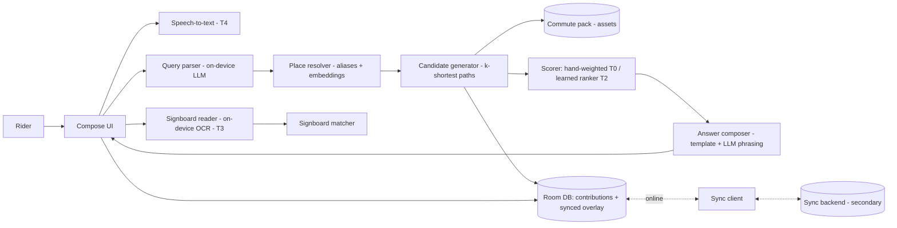
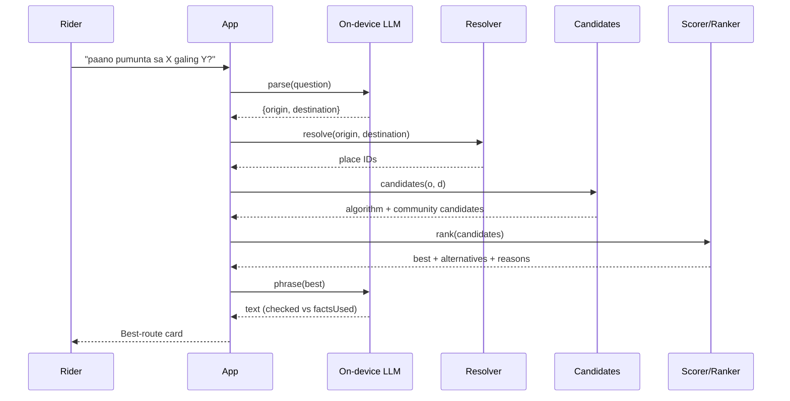

# System Design: CommuteNity

**Project:** CommuteNity
**Date:** 2026-10-09
**Version:** 0.2
**Owner:** Implementer
**Status:** Draft. Runtimes and models are pending [A4](state.md#4-open-assumptions), the backend is pending [A9](state.md#4-open-assumptions), and the ranker is pending [A11](state.md#4-open-assumptions).
**Last reconciled:** 2026-10-09
**PRD:** [Product requirements](prd-commutenity.md)

## 1. Architecture

CommuteNity is a native Android app built with Kotlin and Jetpack Compose ([D8](state.md#5-decisions)). All AI and routing run on the phone. The network is used for only two things:
- first-run model download
- syncing community contributions with a small backend ([D7](state.md#5-decisions))

Neither is on the answer path. The app answers in airplane mode.

**Core principle: models understand, rank, and phrase; code decides facts.**
- **The LLM** turns free text into a structured query, and turns a structured route into friendly text.
- **The candidate generator** (deterministic, over the pack) and **validated community suggestions** are the only sources of routes, stops, fares, and minutes.
- **The scorer or ranker** only orders candidates.

This keeps answers correct and testable. It serves Technical Execution (20%) and Problem & Usefulness (25%) ([JUDGING](JUDGING.md#judging-criteria)).

## 2. Components and Trace



| Feature | Components | Data |
|---|---|---|
| PRD-F1 | Query parser, place resolver | Places and aliases; alias embeddings |
| PRD-F2 | Candidate generator, scorer, answer composer | Pack graph; contribution overlay |
| PRD-F3 | Pack loader | Pack in app assets ([data plan §2](data-commutenity.md#2-commute-pack-schema)) |
| PRD-F4 | Model manager | Model files in app storage |
| PRD-F5 | Candidate generator, scorer, alternatives UI | Same as F2 |
| PRD-F6 | Contribution store, sync client, backend | [Data plan §2.1](data-commutenity.md#21-contribution-schema) |
| PRD-F7 | Ranker | Feature spec plus model file ([data plan §5](data-commutenity.md#5-training-plan)) |
| PRD-F8 | Signboard reader and matcher | Route signboard variants |
| PRD-F9 | Speech-to-text | — |

## 3. Routing Contract

The pack schema lives in the [data plan §2](data-commutenity.md#2-commute-pack-schema).

| Value | Rule (proposed) |
|---|---|
| Graph | Nodes are stops. Edges are route segments (rides) and transfers (walks). |
| Candidates | Up to K=10 loopless paths (Yen's k-shortest on a time-plus-transfer-penalty cost), plus every **valid** community suggestion for the same resolved origin–destination pair |
| Suggestion validity | Every leg references pack routes and stops, the legs are continuous, and the route ID exists. Fares and minutes are computed from the pack, never taken from the suggestion. |
| Features per candidate | `total_minutes`, `fare_php`, `transfers`, `walk_minutes`, `modes_count`, `net_votes`, `vote_count`, `is_community`, `unknown_fare_legs` |
| Baseline score (T0) | Weighted sum of the normalized features. Hand-set weights live in one config file and favor fewer transfers, then time, then fare. Votes give a bounded bonus. |
| Ranker (T2) | Same feature vector → learned score ([A11](state.md#4-open-assumptions)). Swapped in by a feature flag. |
| Pick | The highest score is the auto pick. The rest, in order, are the alternatives (show at most 5). |
| Fare | Sum of segment fares. If any segment fare is missing, the trip fare is "unknown"; no partial totals. |
| Alight point | The last stop of each ride leg, plus a landmark alias where one exists |
| Coverage | If an endpoint is unresolved, return `NOT_IN_PACK`. Never fall back to LLM-invented routing. |
| Data class | When the same fact exists in more than one class, collected beats known, and known beats mock. A candidate carries `uses_mock` if any of its facts are mock, and the UI marks those facts ([D13](state.md#5-decisions)). |

**Feature parity:** a single feature-spec file (names, order, normalization) is shared by the Python training code and the Kotlin app. A parity test checks that both produce identical vectors for a fixture.

## 4. Module Contracts

Proposed shapes. Final names are settled at CP3.

**Query parser** (LLM, constrained JSON):
```json
{ "intent": "trip" | "other",
  "origin": "string | null",
  "destination": "string | null",
  "preference": "cheapest" | "fastest" | "fewest_transfers" | null }
```

**Place resolver:** `resolvePlace(text) → { status: ok | ambiguous | unknown, candidates: PlaceRef[] }`. It tries an exact alias, then a normalized alias, then embedding similarity above a threshold.

**Candidate generator:** `candidates(originId, destId) → Candidate[]`. Each `Candidate` has `{ source: algorithm | community, suggestionId?, legs[{ mode, routeId, boardStopId, alightStopId, fare?, minutes?, signboards[] }], features }`.

**Scorer:** `rank(candidates, preference) → Ranked[]`. Each `Ranked` has `{ candidate, score, reason }`. The reason comes from the top contributing features.

**Answer composer:** `compose(Ranked, lang) → { text, factsUsed[] }`. The template renders first. The LLM phrasing is accepted only if every number and place it mentions is in `factsUsed`.

**Contribution store and sync:**
- `saveSuggestion(od, legs, note)`
- `vote(candidateKey, +1 | -1 | 0)`
- `sync()`: push unsynced items, then pull since the last cursor
- `candidateKey` is a stable hash of the leg sequence, so the same route gets the same votes everywhere.

**Signboard matcher:** `matchSign(ocrText, legs) → { verdict: ride | wrong | unreadable, readText, score }`.

**Error codes:** `MODEL_LOAD_FAILED`, `PARSE_FAILED`, `AMBIGUOUS_PLACE`, `NOT_IN_PACK`, `NO_ROUTE`, `INVALID_SUGGESTION`, `SYNC_FAILED`, `SIGN_UNREADABLE`, `MIC_DENIED`. No stack traces are shown in the UI.

### 4.1 Runtime Sequence



## 5. Security and Privacy

- **On the phone:** questions, audio, and camera frames never leave the phone. LLM output is rendered as plain text.
- **What leaves the phone:** only contributions (suggestions, votes, notes), plus an anonymous random device ID. There are no accounts, names, or location traces.
- **Backend:**
  - Write-only inserts for contributions; public reads of aggregates and suggestions.
  - Validation for leg references and note length (≤ 280 characters).
  - Basic rate limit per device ID.
- **Suggestions are untrusted.** They only ever *order* candidates and add pack-valid paths. They never change fares or stops.

Details: [CLR](clr-commutenity.md).

## 6. Delivery and Recovery

- **Delivery:** a debug or release APK built from the public repo. The README explains how to build it, download the models, and point it at the backend ([JUDGING](JUDGING.md#submission)).
- **Recovery:**
  - A `demo-safe-*` tag plus an archived APK at each tier gate.
  - Models pre-downloaded on the demo phone, with a spare phone ready.
  - A feature flag per tier.

## 7. Non-functional Targets

These are planning targets on the demo phone; none has been measured yet.

| Requirement | Target | Verification |
|---|---|---|
| Offline answer path | Zero network requests from ask through card and alternatives | Airplane mode; network inspector |
| Answer latency (warm) | ≤ 5 s from question to best-route card | 20 timed runs |
| Candidate generation and ranking | ≤ 300 ms | Timed in-app |
| Signboard latency | ≤ 2 s | Timed runs |
| Cold model load | ≤ 20 s | Timed relaunch |
| Model download | ≤ 1.5 GB total at T1, to confirm with the model choice | Storage settings |
| Pack size | ≤ 10 MB | File size |
| Sync | Never blocks the UI; retries with backoff | QA-12 |

## 8. AI Architecture and Safety

Candidate models and runtimes ([A4](state.md#4-open-assumptions)). All are open-weight or on-device, and all are to be verified on the demo phone:

| Role | Candidates | Android runtime candidates |
|---|---|---|
| Parser / phrasing LLM | Gemma 2B/3 1B-class, Qwen2.5 0.5B/1.5B Instruct, Llama 3.2 1B (quantized) | MediaPipe LLM Inference API; llama.cpp via JNI |
| Place embeddings | multilingual-e5-small, multilingual MiniLM | ONNX Runtime Android; MediaPipe Text Embedder |
| Route ranker | Pairwise logistic regression or small GBDT | Plain Kotlin (weights) or ONNX Runtime Android |
| Signboard OCR | ML Kit Text Recognition (on-device), PaddleOCR (ONNX) | ML Kit; ONNX Runtime Android |
| Speech-to-text | Whisper tiny/base multilingual | whisper.cpp via JNI |

| Risk | Control | Eval |
|---|---|---|
| Invented route, stop, or fare | Generator plus pack own the facts; composer fact-check; template fallback | AI-01, AI-02 |
| Wrong place resolution | Ambiguity picker; confidence threshold | AI-03 |
| Prompt injection in the question | Schema-validated parser output; the LLM has no tools | AI-04 |
| Poisoned or spam contributions | Pack-valid legs only; facts from the pack; bounded vote influence; rate limit | AI-07 |
| Ranker overfits team preferences | Held-out split by origin–destination; ships only if it beats the baseline; disclosed | AI-06 |
| Wrong signboard verdict | Deterministic matcher, conservative threshold, shows the text it read | AI-05 |
| Model too slow or large for the phone | Smaller model fallback; template answer if phrasing fails | QA-05 |

### 8.2 AI Craft

- The parser prompt contains Taglish few-shot examples and the JSON schema. It never contains pack data, which keeps it short and fast.
- The phrasing input is only the structured best route plus its reason.
- Each model call gets one retry, then falls back to deterministic output.
- The full eval suite reruns after any change to a model, prompt, resolver, ranker, or the pack ([QAD §7](qad-commutenity.md#7-ai-evaluation)).
