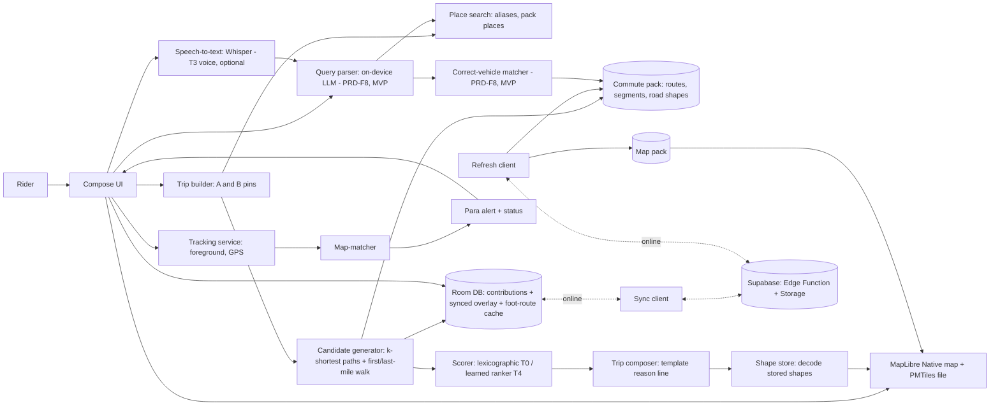
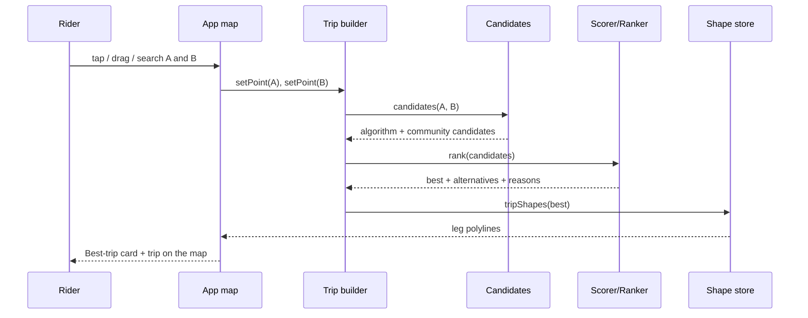
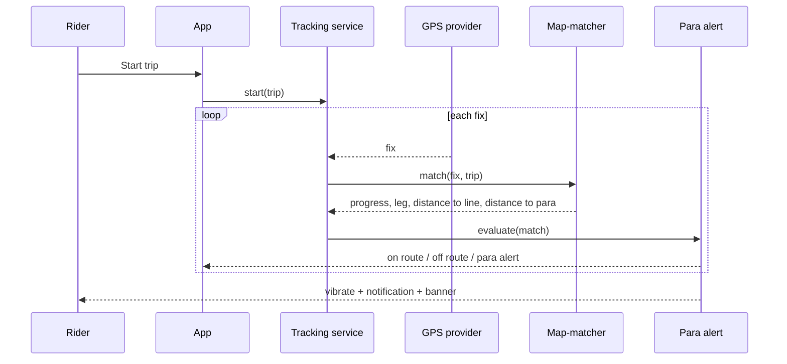
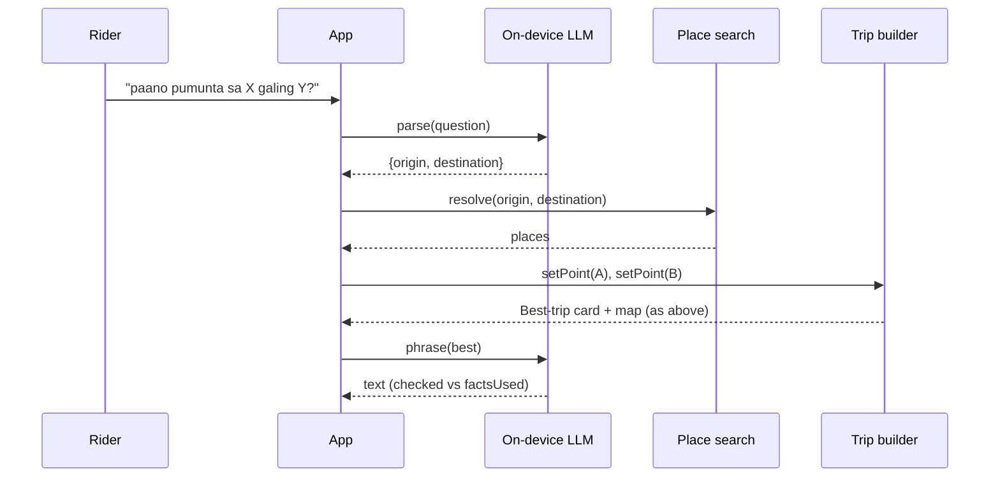

# System Design: CommuteNity

**Project:** CommuteNity
**Date:** 2026-10-09
**Version:** 0.4
**Owner:** Implementer
**Status:** Draft. Makati only ([D20](state.md#5-decisions)), map-first with precomputed road shapes and an offline PMTiles map ([D21](state.md#5-decisions) to [D23](state.md#5-decisions)), online refresh and in-trip tracking ([D24](state.md#5-decisions), [D25](state.md#5-decisions)). The map pack is pending [A14](state.md#4-open-assumptions); LLM runtimes are pending [A4](state.md#4-open-assumptions) and pick the model for PRD-F8, which is release-critical and part of the MVP ([D31](state.md#5-decisions)). Contribution sync and the ranker plan are decided in [D17](state.md#5-decisions) and [D18](state.md#5-decisions).
**Last reconciled:** 2026-10-10
**PRD:** [Product requirements](prd-commutenity.md)

## 1. Architecture

CommuteNity is a native Android app built with Kotlin and Jetpack Compose ([D8](state.md#5-decisions)). The map is rendered by **MapLibre Native Android** from a local **Protomaps PMTiles** file ([D23](state.md#5-decisions)). All trip computation, ordering, tracking, and AI run on the phone. **There is no routing engine on the device** ([D22](state.md#5-decisions)): road-following lines are shapes computed at data-build time and stored in the commute pack. The phone only decodes and draws them.

The network is used for only these, never on the answer path or the tracking path:
- **Refresh** ([D24](state.md#5-decisions)): fetch and cache the latest pack (with shapes), map pack, community suggestions, and vote aggregates; fetch foot routes for first/last-mile walks. Pack and map come from Supabase Storage; community data through the [D17](state.md#5-decisions) Edge Function.
- **Sync** of community contributions ([D7](state.md#5-decisions), [D17](state.md#5-decisions)).
- First-run download of the map pack (if not bundled) and the LLM model (PRD-F8, MVP per [D31](state.md#5-decisions)); the Whisper model only if voice (PRD-F9) ships.

The app computes, draws, and tracks in airplane mode. A refresh or sync failure never blocks the UI.

**Core principle: code decides facts; models only understand, rank, and phrase.**
- **The candidate generator** (deterministic, over the pack) and **validated community suggestions** are the only sources of routes, stops, fares, minutes, distances, and shapes.
- **The scorer or ranker** only orders candidates.
- **The map-matcher and para-alert logic** are deterministic code. No model sits on the tracking path.
- **The LLM (PRD-F8, release-critical per [D31](state.md#5-decisions))** turns free text into a structured query and phrases an already-computed trip. It never decides a fact or the correct-vehicle verdict ([D27](state.md#5-decisions)).

This keeps answers correct and testable. It serves Technical Execution (20%) and Problem & Usefulness (25%) ([JUDGING](JUDGING.md#judging-criteria)).

## 2. Components and Trace



| Feature | Components | Data |
|---|---|---|
| PRD-F1 | Trip builder, place search, MapLibre map, location permission flow | Pack places and aliases; map pack; optional online geocoding through the server |
| PRD-F2 | Candidate generator (incl. first/last-mile rule), scorer, trip composer, shape store, MapLibre trip layer | Pack graph with segment shapes and `distance_m`; contribution overlay; cached foot routes |
| PRD-F3 | Pack loader, map pack loader | Pack in app assets or refreshed storage ([data plan §2](data-commutenity.md#2-commute-pack-schema)); map pack ([data plan §2.2](data-commutenity.md#22-offline-map-pack)) |
| PRD-F4 | Refresh client | Manifest, pack, map pack, foot-route cache ([data plan §2.3](data-commutenity.md#23-refresh-manifest-and-versioning)) |
| PRD-F5 | Candidate generator, scorer, alternatives UI | Same as F2 |
| PRD-F6 | Contribution store, sync client, backend | [Data plan §2.1](data-commutenity.md#21-contribution-schema) |
| PRD-F12 | Rider Q&A evidence module, Questions screen, trip-card evidence line | Bundled `data/mock/rider-qa.json`; the rider's own answers in Room or memory ([D34](state.md#5-decisions)) |
| PRD-F7 | Tracking service, map-matcher, para alert, notification | Active trip's shapes and para points; `TrackingConfig` |
| PRD-F8 | Query parser (hybrid: keyword cues plus LLM extraction), place search, correct-vehicle matcher, trip composer (template; LLM phrasing off per [D32](state.md#5-decisions)) | Pack places; `routes.signboards[]` and route names |
| PRD-F9 | Speech-to-text (whisper.cpp) | Whisper model file |
| PRD-F10 | Ranker | Feature spec plus model file ([data plan §5](data-commutenity.md#5-training-plan)) |

## 3. Routing Contract

The pack schema lives in the [data plan §2](data-commutenity.md#2-commute-pack-schema). The phone does graph search over stops only; it never computes road geometry.

| Value | Rule (proposed) |
|---|---|
| Graph | Nodes are stops. Edges are route segments (rides) and transfers (walks). Each segment and transfer carries a stored `shape` and `distance_m`. |
| Endpoints | Point A and point B are arbitrary map points ([D21](state.md#5-decisions)). Each is first checked against the pack's Makati coverage, then attached to nearby stops by the first/last-mile rule below. |
| Candidates | Up to K=10 loopless paths (Yen's k-shortest on a time-plus-transfer-penalty cost) from the stops attached to A to the stops attached to B, plus every **valid** community suggestion whose origin and destination places match the resolved place pair for A and B. |
| Suggestion validity | Every leg references pack routes and stops, the legs are continuous, and the route ID exists. Fares, minutes, distance, and shapes are taken from the pack, never from the suggestion. |
| Features per candidate | Base features: `total_minutes`, `fare_php`, `transfers`, `walk_minutes`, `modes_count`, `net_votes`, `vote_count`, `is_community`, `unknown_fare_legs`. Ranker input also includes preference-specific interactions: each applicable base feature × `fastest`, `cheapest`, `fewest_transfers`, or `default`. This feature spec is the D18 spec and is unchanged. `walk_minutes` includes first/last-mile and transfer walking. |
| Display values per trip | `distance_m` (sum of leg distances), `walk_m` and `walk_minutes` (first/last-mile plus transfers), per-leg distance and shape, para point per ride leg. Display values are not ranker features. |
| Baseline order (T0) | Deterministic lexicographic order, not a weighted sum ([D16](state.md#5-decisions)). Default and `fewest_transfers`: transfers → `total_minutes` → `fare_php` → `walk_minutes`; `fastest` or `cheapest` promotes that requested criterion and retains the remaining order. The vote term breaks only a tie after those criteria: trip `net_votes` plus tied rider Q&A answers (one "worked" vote each, [D34](state.md#5-decisions)), clamped together to −3…+3, with mock answers left out on the hero pair ([D13](state.md#5-decisions)); stable `candidateKey` is last. Missing fare sorts after known fare. |
| Ranker (T4) | Pairwise logistic regression trained on the D18 feature spec and exported as JSON `{ feature_names, normalization, intercept, weights }`, evaluated in Kotlin. It is swapped in by a feature flag only if it beats T0 top-1 agreement on held-out `known` pairs. |
| Pick | The first candidate in the baseline order is the auto pick. The rest, in order, are alternatives (show at most 5). |
| Fare | Sum of segment fares. First/last-mile walks cost nothing. If any segment fare is missing, the trip fare is "unknown"; no partial totals. |
| Alight point | The last stop of each ride leg, plus a landmark alias where one exists. It is also the **para point**: where the rider says "para" and where the para alert aims ([D25](state.md#5-decisions)). |
| Drawing | The map draws each leg from its stored shape. A ride leg is the concatenation of its segment shapes from board stop to alight stop. Nothing is drawn as a straight line except the labelled offline first/last-mile walk. |
| Coverage | If A or B is outside the pack's Makati coverage, or has no stop within `MAX_WALK_M`, return `NOT_IN_PACK`. If both are covered but no path exists, return `NO_ROUTE`. Never fall back to LLM-invented routing. |
| Data class | When the same fact exists in more than one class, collected beats known, and known beats mock. A candidate carries `uses_mock` if any of its facts are mock, and the UI marks those facts ([D13](state.md#5-decisions)). |

**First/last-mile rule ([D22](state.md#5-decisions)).** The pack holds stop-to-stop shapes only. The walk between a tapped point and a stop is computed at runtime:
1. Attach each pin to up to `SNAP_STOPS` nearest stops within `MAX_WALK_M` by great-circle distance. Both are config, set at CP2 (proposed starting values are tuned on the hero trip).
2. **Ordering never depends on the network.** The ordering and `walk_minutes` use straight-line distance divided by `WALK_M_PER_MIN` (config), so the same pins give the same order online and offline.
3. **Offline, or no cached foot route:** draw a dashed straight line labelled "walk ~N m".
4. **Online:** the refresh client asks our server for a foot route for the pin–stop pair and caches it in Room (local only, not synced). A cached foot route replaces the dashed line, and the card shows its distance and minutes. The card never waits for this request.
5. The foot route is cached by rounded endpoint coordinates, so repeated pins reuse it.

**Feature parity:** a single feature-spec file (names, order, normalization) is shared by the Python training code and the Kotlin app. A parity test checks that both produce identical vectors for a fixture (QA-15).

**Resolved place pair.** Community suggestions are keyed by origin and destination place ([data plan §2.1](data-commutenity.md#21-contribution-schema)). A pin resolves to the nearest pack place within `MAX_WALK_M`; the pair of resolved places selects suggestions and enables "Suggest a trip". A pin with no place near it gets algorithm candidates only. Proposed; confirm at CP2.

## 4. Module Contracts

Proposed shapes. Final names are settled at CP3.

**Trip builder:** `setPoint(which: A | B, source: tap | drag | search | myLocation, latLng, placeId?) → TripRequest { a, b, preference? }`. A request is computed as soon as both points are set and re-computed when either is moved. `myLocation` needs the location permission; without it the other three sources still work.

**Place search** (also resolves LLM-extracted places): `resolvePlace(text) → { status: ok | ambiguous | unknown, candidates: PlaceRef[] }`. It tries an exact alias, then a normalized alias, then fuzzy string match, then (PRD-F8 only, if the embedding model is installed) embedding similarity above a threshold. Online geocoding through the server is an optional extra; its failure falls back to pack places.

**Candidate generator:** `candidates(a: Point, b: Point) → Candidate[]`. Each `Candidate` has `{ source: algorithm | community, suggestionId?, legs[{ kind: first_mile | ride | transfer_walk | last_mile, mode, routeId?, boardStopId, alightStopId, fare?, minutes?, distance_m, signboards[], shapeRef }], features, display{ distance_m, walk_m, walk_minutes } }`.

**Scorer:** `rank(candidates, preference) → Ranked[]`. Each `Ranked` has `{ candidate, score, reason }`. The reason comes from the top contributing features.

**Trip composer:** `compose(Ranked, lang) → { text, factsUsed[] }`. The template renders the answer. LLM phrasing is **off** ([D32](state.md#5-decisions)): on the demo phone it took about 5.3 s and the owner judged it not natural. If it is ever turned back on, the phrasing is accepted only if every number and place it mentions is in `factsUsed`.

**Shape store:** `shapeFor(legRef) → LatLng[]` decodes the encoded polyline stored in the pack for a segment or transfer; `tripShapes(trip) → LegShape[]` returns one line per leg for the map, and the active trip's full polyline for tracking. `footShape(pinStop) → LatLng[]?` returns a cached foot route or `null` (the caller then draws the dashed straight line). Decoded shapes are cached in memory for the visible trip only.

**Refresh client:** `refresh() → RefreshResult { packVersion, mapVersion, communityPulled, footRoutesCached, ok }`.
- Reads the manifest from Supabase Storage ([data plan §2.3](data-commutenity.md#23-refresh-manifest-and-versioning)) and downloads only a newer pack or map pack, resumable, with checksum verification before an atomic swap. The bundled pack stays as the fallback.
- Pulls community data through the [D17](state.md#5-decisions) Edge Function pull path.
- Fetches foot routes on demand through the server.
- Never swaps the pack or map under an **active trip**; it applies at the next idle moment. After a pack swap, local suggestions are revalidated against the new pack.
- Failure returns a status for the top bar and never blocks the UI.

**Tracking service** (Android foreground service, type `location`): started by "Start trip" with the chosen `Trip`. It reads GPS fixes (see below), runs the map-matcher, and publishes `TrackingState { status: on_route | off_route | gps_lost | arrived, legIndex, progress_m, distanceToParaM, stopsToPara, accuracyM, lastFixAgeS }` to the UI and to its ongoing notification. The active trip (A, B, `candidateKey`) is stored locally so the service can rebuild it from the pack after a process restart. No rerouting: to recalculate, the rider sets a new point A ("use my location").

**GPS source:** `LocationManager` GPS provider or `FusedLocationProviderClient` (Android), at the interval in `TrackingConfig`. Both read the GPS chip without a data connection. The choice is made at the T2 spike on the demo phone.

**Map-matcher** (pure Kotlin, no Android types, JVM-testable): `match(fix, activeTrip, prev) → MatchResult { snapped, progress_m, legIndex, distanceToLine_m, distanceToParaM, stopsToPara }`. It projects the fix onto the active trip's polyline: nearest point on the polyline, then progress along it. To avoid jumping between parallel or overlapping stretches, it searches a window around the previous progress first (`BACKTRACK_M` behind, `LOOKAHEAD_M` ahead), and falls back to a full search when nothing in the window is within the off-route distance. Fixes worse than `MAX_ACCURACY_M` are ignored. `stopsToPara` counts stops in the `segments` order ahead of the rider.

**Para alert:** `evaluate(MatchResult, state) → state'` raises the alert once per ride leg when `distanceToParaM ≤ PARA_ALERT_M`. Output: vibration, a heads-up notification, and an on-screen banner. No sound and no TTS ([D26](state.md#5-decisions)). If GPS was lost and the first fix after recovery is past the threshold but before the alight point, it fires once; if the rider is already past the alight point it shows "Passed <stop>" and does not vibrate. Proposed.

**Off-route:** `off_route` is entered when `distanceToLine_m > OFF_ROUTE_M` for at least `OFF_ROUTE_S` seconds, and clears when the fix is within `OFF_ROUTE_M` again. `gps_lost` is entered after `GPS_STALE_S` without an acceptable fix.

**`TrackingConfig`** (one file, the only place thresholds live; tuned in testing, [A16](state.md#4-open-assumptions)):

| Key | Proposed value | Source |
|---|---|---|
| `OFF_ROUTE_M` | 100 | [D25](state.md#5-decisions) |
| `OFF_ROUTE_S` | 30 | [D25](state.md#5-decisions) |
| `PARA_ALERT_M` | 300 | [D25](state.md#5-decisions) |
| `GPS_INTERVAL_MS`, `GPS_STALE_S`, `MAX_ACCURACY_M`, `BACKTRACK_M`, `LOOKAHEAD_M`, `ARRIVE_M` | Set during the A16 tuning; not yet chosen | — |

**Query parser** (hybrid, PRD-F8, [D32](state.md#5-decisions)). Output contract:
```json
{ "intent": "trip" | "vehicle_check" | "other",
  "origin": "string | null",
  "destination": "string | null",
  "preference": "cheapest" | "fastest" | "fewest_transfers" | null,
  "vehicle_text": "string | null" }
```
For `trip`, the origin and destination go through place search and set point A and point B. For `vehicle_check`, `vehicle_text` goes to the matcher.

How the JSON is produced (measured in the [LLM speed test](https://github.com/geadlydrim/appbuildersph-hackathon/blob/prototype/llm-speed-test/spikes/llm-speed-test/RESULTS.md)):
1. **Cues (code):** Taglish and English keyword lists set `intent = vehicle_check` (e.g. "tama ba", "tamang", "karatula", "nakasulat", "it says") and `preference` ("walang lipat" → `fewest_transfers`, "mura"/"tipid" → `cheapest`, "mabilis" → `fastest`). The lists live in one config file.
2. **Extraction (LLM):** Gemma 4 E2B on LiteRT-LM fills only `{origin, destination}`, or `{vehicle_text}` for a vehicle check, under a JSON schema (`ResponseFormat.json`). The prompt holds the question only, after a short few-shot system prompt.
3. **Copy check (code):** a value survives only if the rider wrote it, compared word-aligned after trimming edge punctuation and a `pa-` prefix ("Pa-Greenbelt" → "Greenbelt"). Anything else becomes null. If origin equals destination, origin becomes null.
4. **Assembly (code):** `intent` is `trip` if a place survived, else `other`; `preference` is set only for trips.

**Lifecycle:** load the engine at app start in the background (cold load 17–29 s on the GPU backend), and keep one conversation created ahead of the question (`prefillPrefaceOnInit`; 4–8.5 s to create). Replace it right after each question.

Enum-constrained spans were tried and failed (the decoder closed each string after its first word), so the copy check runs after decoding instead.

**Correct-vehicle matcher** (deterministic, [D27](state.md#5-decisions)): `matchVehicle(text, trip, progress) → { verdict: yes_ride | no_look_for | not_sure, expected: signboard?, matchedLegIndex?, score }`. It normalizes the text and fuzzy-matches it against `routes.signboards[]` and the route name of the active trip's next boarding leg (or the first ride leg before the trip starts). It returns `yes_ride` only above a conservative threshold; a clear match to a different route or no match returns `no_look_for` with the expected signboard; anything in between returns `not_sure`. The model never sets the verdict.

**Contribution store and sync:**
- `saveSuggestion(od, legs, note)` and `vote(candidateKey, +1 | -1 | 0)` write to Room first.
- `sync()` signs in anonymously if needed, then sends a batched push/pull request to the Supabase Edge Function; Room retains unsynced mutations until acknowledged.
- The function validates legs and note length, writes suggestions or current votes, applies a server-side per-identity mutation limit, and returns suggestions plus aggregate vote totals only.
- `candidateKey` is a stable hash of the leg sequence, so the same route gets the same votes everywhere.

**Rider Q&A evidence** ([D34](state.md#5-decisions); T1, the first thing cut; not part of the MVP gate):
- **Sources:** the bundled `data/mock/rider-qa.json` (read-only; every thread and answer is `source_class: mock`, `source: hand-written sample`) and the rider's own threads and answers, kept in Room or memory. The rider's own answers are marked as theirs and are never synced or sent anywhere.
- **Tie:** an answer is tied to one candidate only through the optional "This trip worked" chip, which lists the pack-valid candidates on screen. The answer stores that candidate's stable `candidateKey`. Without the chip an answer has no key, is text only, and counts for nothing. A key that is not a pack-valid candidate for the pair is dropped.
- **Contract:** `evidenceFor(candidateKey, odPair) → { tiedAnswers, sample: Boolean }`. `tiedAnswers` is the number of answers tied to that candidate for that pair, and `sample` is true when any of them is mock. The trip card shows "N riders say this works" from it, marked Sample when `sample` is true.
- **Ordering:** `orderingAnswers(candidateKey, odPair)` equals `tiedAnswers`, except that on the D30 pair it leaves mock answers out. Each counted answer is one "worked" vote added to the trip `net_votes` before the D16 clamp (−3…+3). It only breaks an otherwise exact tie. There is no new ordering rule, no votes on answers, and the D18 ranker feature spec is unchanged.
- **Counting is structural.** Code counts keys; no model reads answer text to count it. Q&A text is never a fact source, so fares, stops, minutes, and shapes still come only from the pack ([D33](state.md#5-decisions)).
- **Stretch (not MVP):** after the `demo-safe-f8` tag exists, the on-device LLM may read untied answers and extract a route or signboard mention. Code keeps it only if it matches a pack route (the copy-check idea of [D32](state.md#5-decisions)) and then ties the answer as above. Cut if not working by 7:00 AM.

**Error codes:** `MODEL_LOAD_FAILED`, `PARSE_FAILED`, `AMBIGUOUS_PLACE`, `NOT_IN_PACK`, `NO_ROUTE`, `INVALID_SUGGESTION`, `SYNC_FAILED`, `REFRESH_FAILED`, `MAP_FILE_MISSING`, `LOCATION_DENIED`, `GPS_UNAVAILABLE`, `MIC_DENIED`. No stack traces are shown in the UI.

### 4.1 Runtime Sequences

**Build a trip (T0, offline):**



**Track a trip (T2, offline):**



**Ask in words (PRD-F8, MVP per [D31](state.md#5-decisions); offline):**



## 5. Security and Privacy

- **On the phone:** GPS fixes, tracks, the active trip, audio, typed questions, and vehicle texts never leave the phone. **Location stays on the device.** LLM output is rendered as plain text. Instrumentation events carry no coordinates ([PRD §5.6](prd-commutenity.md#56-instrumentation)).
- **What leaves the phone:**
  - contributions (suggestions, votes, notes) and an anonymous Auth credential, through sync;
  - refresh downloads (manifest, pack, map), which are plain reads with no rider data;
  - **only when online and only when needed:** the two endpoints of a first/last-mile walk (pin and stop) for a foot route, and typed search text for online geocoding. "Use my location" as point A makes the foot-route request carry that point. The GPS track is never sent. Both requests fail soft: offline or denied, the app uses the dashed walk line and pack places.
  - There are no user-facing accounts or names.
  - Rider Q&A text never leaves the phone: the rider's own questions and answers are never synced ([D34](state.md#5-decisions)).
- **Foreground service:** tracking runs as an Android foreground service of type `location`, with an ongoing notification the rider can see and stop. It needs the location permission (fine) and, on newer Android, the notification permission. Tracking starts only from an explicit "Start trip" and stops on arrival or on cancel. Whether the demo phone's HyperOS battery rules keep it alive with the screen off is verified at T2 (QA-11).
- **Map data:** the offline map is an OSM-derived extract. OSM attribution is shown on the map and in the README. The app never bulk-downloads tiles from tile.openstreetmap.org ([D23](state.md#5-decisions)).
- **Backend:**
  - Supabase anonymous Auth plus a single authenticated Edge Function for sync; the Android app has no service-role key.
  - The function validates pack references and note length (≤ 280 characters), applies a server-side per-identity mutation limit, and is the only privileged writer.
  - Pull responses contain suggestions and vote aggregates only; raw vote rows and anonymous identity values are never public.
  - The foot-route and geocode requests use the same anonymous credential and the same no-service-role rule. Where they are hosted, and the engine behind them, is open ([A15](state.md#4-open-assumptions)).
- **Suggestions are untrusted.** They only ever *order* candidates and add pack-valid paths. They never change fares, stops, or shapes.

Details: [CLR](clr-commutenity.md).

## 6. Delivery and Recovery

- **Delivery:** a debug or release APK built from the public repo. The README explains how to build it, get the map pack and models, and point it at the backend ([JUDGING](JUDGING.md#submission)).
- **Recovery:**
  - A `demo-safe-*` tag plus an archived APK at each tier gate.
  - The bundled pack stays as the fallback for every refresh; a spare phone has the APK, map, and models pre-installed.
  - A feature flag per tier.
  - If tracking isn't passing in time, the demo uses a recorded mock-location GPS route, labelled as simulated ([BUILD §1](build-commutenity.md#1-build-sequence)).

## 7. Non-functional Targets

These are planning targets on the demo phone. Only the PRD-F8 rows were measured, in the [LLM speed test](https://github.com/geadlydrim/appbuildersph-hackathon/blob/prototype/llm-speed-test/spikes/llm-speed-test/RESULTS.md) ([D32](state.md#5-decisions)).

| Requirement | Target | Verification |
|---|---|---|
| Offline trip path | Zero network requests from setting A and B through card, alternatives, and tracking | Airplane mode; network inspector |
| Map render offline | Makati map shown at start with no network, and pan/zoom stays usable | Airplane mode on the demo phone; CP1 map spike |
| A/B set to best-trip card (warm) | ≤ 1 s | 20 timed runs |
| Candidate generation and ranking | ≤ 300 ms | Timed in-app |
| Tracking update | ≤ 1 s from GPS fix to updated status on screen | Timed with a mock-location track |
| Battery | Not measured. A 30-minute tracking run on the demo phone records the drop; GPS interval is a config knob if it's too heavy. | Battery stats before and after |
| Ask in words, warm (PRD-F8) | ≤ 5 s from question to best-trip card | 20 timed runs |
| Correct-vehicle match (PRD-F8) | ≤ 1 s after the text is available | Timed runs |
| Cold model load (PRD-F8) | ≤ 20 s, in the background at app start. Measured 16.9–29.0 s for Gemma 4 E2B on the GPU backend ([D32](state.md#5-decisions)), so it can't block the first screen | Timed relaunch |
| Ask in words, measured (PRD-F8) | Parser only: worst p95 2.84 s, median 2.10 s over 10 questions × 20 runs on the demo phone ([D32](state.md#5-decisions)) | 20 timed runs |
| Model download (PRD-F8) | 2.59 GB (Gemma 4 E2B), over the old 1.5 GB target; accepted by the owner and pre-installed on the demo phone ([D32](state.md#5-decisions)) | Storage settings |
| Pack size (with shapes) | ≤ 10 MB, unmeasured; shapes may push it up | File size |
| Map pack (PMTiles) size | TBD, depends on the Makati extract and zoom range ([A14](state.md#4-open-assumptions)) | File size |
| Refresh and sync | Never block the UI; retry with backoff; an interrupted download resumes or restarts cleanly | QA-04, QA-09 |

## 8. AI Architecture and Safety

Models and runtimes ([D32](state.md#5-decisions) for the LLM; [A4](state.md#4-open-assumptions) for the rest). The T0 to T2 path runs no model; the MVP's model is the PRD-F8 LLM ([D31](state.md#5-decisions)). If it later fails on the demo phone, the fallbacks are a smaller model, then llama.cpp, then the rule-based parser plus on-device embedding place search, never a cloud model. All of these are open-weight or on-device:

| Role | Candidates | Android runtime candidates |
|---|---|---|
| Parser LLM (PRD-F8, MVP; decided, [D32](state.md#5-decisions)) | **Gemma 4 E2B** (`gemma-4-E2B-it.litertlm`, 2.59 GB, Apache-2.0, ungated) with the hybrid parser. Rejected on the demo phone: Gemma3-1B int4, Qwen3-0.6B int4, and the E2B GPU-specific build | **LiteRT-LM** `litertlm-android:0.18.0`, GPU backend, JSON-schema `ResponseFormat`. Fallback llama.cpp via JNI (needs a GBNF patch). MediaPipe LLM Inference is maintenance-only. |
| Place embeddings (PRD-F8, optional; the last-resort on-device fallback per [D31](state.md#5-decisions)) | EmbeddingGemma (270M); multilingual-e5-small int8 | LiteRT-LM EmbeddingEngine; fallback MediaPipe Text Embedder or ONNX Runtime Android. Alias and fuzzy matching run first and carry T0 to T2; alias vectors are precomputed. |
| Route ranker (T4) | Pairwise logistic regression or small GBDT | Plain Kotlin (JSON weights or tree dump); ONNX Runtime Android only if it's already in the app |
| Speech-to-text (T3 voice, optional) | Whisper tiny/base multilingual | whisper.cpp via JNI |
| Correct-vehicle matcher | No model: deterministic fuzzy string match ([D27](state.md#5-decisions)) | Plain Kotlin |
| Map-matcher, para alert | No model: geometry on the stored shape | Plain Kotlin |

**Dropped:** OCR signboard scanning and TTS ([D26](state.md#5-decisions)). ML Kit Text Recognition is no longer a dependency.

| Risk | Control | Eval |
|---|---|---|
| Invented route, stop, fare, or shape | Generator plus pack own the facts; composer fact-check; template fallback; validator checks every shape | AI-01, AI-02, QA-16 |
| Wrong place resolution (search or LLM extraction) | Ambiguity picker; confidence threshold | AI-03 |
| Prompt injection in the question | Schema-validated parser output; the LLM has no tools | AI-04 |
| Poisoned or spam contributions | Pack-valid legs only; facts from the pack; bounded vote influence; rate limit | AI-07 |
| Ranker overfits team preferences | Held-out split by origin–destination; ships only if it beats the baseline; disclosed | AI-06 |
| Wrong "ride this" verdict | Deterministic matcher, conservative threshold, shows the text it matched; LLM only extracts text | AI-05 (0 false "ride this"), QA-13 |
| Wrong or noisy GPS gives a false off-route or a mistimed para alert | Accuracy filter, duration gate before off-route, one-shot alert, thresholds in config, tuned on Makati tracks | QA-10, QA-11, [A16](state.md#4-open-assumptions) |
| Model too slow or large for the phone | Smaller model fallback, then llama.cpp, then the rule-based parser plus on-device embedding place search ([D31](state.md#5-decisions)); template answer if phrasing fails; T0 to T2 don't depend on it | QA-12 |

### 8.2 AI Craft

- The parser system prompt holds a few Taglish few-shot examples and no pack data, which keeps it short and fast. Few-shot place names can leak into answers (Gemma3-1B returned the example's "Cubao"); the copy check catches that.
- LLM phrasing is off ([D32](state.md#5-decisions)). If it returns, its input is only the structured best trip plus its reason.
- Each model call gets one retry, then falls back to deterministic output.
- The full eval suite reruns after any change to a model, prompt, place search, ranker, matcher, or the pack ([QAD §7](qad-commutenity.md#7-ai-evaluation)).
