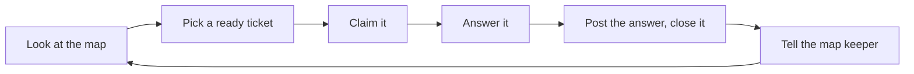

# Team Guide: How We Work on CommuteNity

Read this once before you start. It takes about 10 minutes.

## 1. The big picture (plain English)

**What we're building.** CommuteNity is an Android app. You ask it, in Taglish, how to get somewhere in Metro Manila, and it picks the best trip: which jeep or train, where to say "para", and how much it costs. It works **with no signal**, because the AI runs on the phone. Riders can also share their own trips and vote on what worked. Those contributions sync when the phone is back online.

**Deadline.** The code freeze is **10:00 AM, Oct 10**. Whatever is on GitHub at 10:00 AM is what the judges see.

**How we work: decide first, then build.** We don't jump straight into code. A few decisions, made badly, would waste the whole night: which phone, which AI model, which routes we cover. So we work in two phases:

1. **Planning (until 7:00 PM tonight).** We answer a short list of open questions. Each question is a GitHub issue called a **ticket**. All the tickets hang off one parent issue called the **map**. Anyone can pick up a ticket, answer it, and close it.
2. **Building (7:00 PM until the freeze).** Once the questions are answered, they're turned into build tasks, also GitHub issues, and we build in fixed stages (**tiers**). Each tier must fully work before the next one starts, so we always have a working demo.

**7:00 PM is a hard stop for planning.** Any ticket still open then takes the default answer written at the bottom of the ticket, and we start building anyway.

**The docs are the source of truth.** Everything we've decided is written in `docs/fmd/`. Start with `docs/fmd/state.md`: it says where we are, what's decided, and what's still open.

## 2. Words you'll see

| Word | Meaning |
|---|---|
| **Map** | GitHub issue [#1](https://github.com/geadlydrim/appbuildersph-hackathon/issues/1). The list of all planning tickets and every decision made so far. |
| **Ticket** | One open question, as a GitHub issue under the map |
| **Ready** | A ticket that's open, nobody is assigned to it, and it isn't waiting on another ticket |
| **Blocked** | A ticket that depends on another one. GitHub shows "Blocked by …" on it. |
| **Claim** | Assigning yourself to a ticket, so nobody else works on it at the same time |
| **Ticket type** | *grilling* = a discussion, where an AI asks questions and the humans decide. *task* = a checklist people do by hand. *prototype* = throwaway test code. *research* = an AI reads docs and reports back. |
| **Tier** | One build stage. T0 = ask a question offline and get the best trip. T1 = alternatives and community. T2 = trained ranker. T3 = signboard scanner. T4 = voice. |
| **Source class** | Where a piece of data came from. `collected` = we verified it today. `known` = we know it from experience. `mock` = made up to fill gaps, and always labelled "sample data" in the app. |
| **Route vs trip** | A **route** is one line (one jeepney route, or MRT-3). A **trip** is your whole door-to-door plan. Full list: [`GLOSSARY.md`](../GLOSSARY.md). |

## 3. One-time setup

**Accept the GitHub invite.** Check your email or <https://github.com/notifications>. Tell the project owner (`geadlydrim`) your GitHub username if you haven't been invited yet.

**Install the tools.** You need:
- Git: <https://git-scm.com>
- GitHub CLI: <https://cli.github.com>
- Android Studio, for the build phase

**Sign in and clone:**

```sh
gh auth login                      # choose GitHub.com → HTTPS → log in with browser
git clone https://github.com/geadlydrim/appbuildersph-hackathon.git
cd appbuildersph-hackathon
```

**Read, in this order:**
1. [`docs/fmd/state.md`](fmd/state.md): where we are
2. [`GLOSSARY.md`](../GLOSSARY.md): the words we use
3. [Map #1](https://github.com/geadlydrim/appbuildersph-hackathon/issues/1): the open questions

**If you use an AI coding agent:**
- The repo ships its own skills in `.agents/skills/`: wayfinder, grilling, research, and others.
- Open the repo in your agent and **start a new session** after pulling. Most agents only load skills at startup.
- omp reads `.agents/skills/` automatically. If you use Claude Code or Cursor, tell the project owner so we can make the skills visible to your tool.
- The agent reads [`AGENTS.md`](../AGENTS.md) for the project rules.

## 4. Planning phase: what to do (until 7:00 PM)

### The loop



### Step by step

**1. See what's open and unclaimed:**

```sh
gh issue list --state open --search "no:assignee -label:wayfinder:map"
```

Then open the map in the browser and check which of those say **Blocked by**. Skip any that do.

```sh
gh issue view 1 --web
```

**2. Read the ticket:**

```sh
gh issue view <number>
```

**3. Claim it.** Do this first, before any work:

```sh
gh issue edit <number> --add-assignee @me
```

**4. Answer it.** Pick one of these:
- **With an AI agent.** In your agent, run:
  ```
  /skill:wayfinder https://github.com/geadlydrim/appbuildersph-hackathon/issues/<number>
  ```
  The agent asks you questions and you make the decisions. It records the answer, closes the ticket, and updates the docs.
- **Without an agent.** Talk it through with the team, then post the decision yourself:
  ```sh
  gh issue comment <number> --body "Decision: … Why: …"
  gh issue close <number>
  ```
  Then message the **map keeper** (`geadlydrim`). They add the one-line summary to the map and update `state.md`, so four people aren't editing the same file at once.

**5. Repeat.** Closing a ticket can unblock others. Check the list again.

### Who does what first

| Ticket | Who |
|---|---|
| [Roles: who owns each workstream?](https://github.com/geadlydrim/appbuildersph-hackathon/issues/2) | Project owner, first. It takes about 5 minutes. |
| [Which phone presents the demo?](https://github.com/geadlydrim/appbuildersph-hackathon/issues/3) | **Everyone, now.** Comment with your phone's model, chip, RAM, Android version, and free storage. |
| [Which corridors does the pack cover?](https://github.com/geadlydrim/appbuildersph-hackathon/issues/6) | Whoever knows the commutes best (the data owner) |
| [Which sync backend?](https://github.com/geadlydrim/appbuildersph-hackathon/issues/9) | Android owner |
| [Ranker data format](https://github.com/geadlydrim/appbuildersph-hackathon/issues/10) | Ranker owner |
| [LLM speed test on the demo phone](https://github.com/geadlydrim/appbuildersph-hackathon/issues/8) | AI owner. It's blocked until the phone is picked. |
| [Travel minutes and "most efficient"](https://github.com/geadlydrim/appbuildersph-hackathon/issues/7) | Data owner. It's blocked until corridors are picked. |

### Useful prep while you wait

None of this needs a decision first:
- Install Android Studio and set up your phone for USB debugging.
- Install `scrcpy` on the laptop that will present.
- Make a Hugging Face account and accept the Gemma model license. It's needed to download that model.
- Save the LTFRB jeepney and bus fare guides from a normal browser into the repo. The website blocks scripts, so this has to be done by hand.
- Type the LRT-1, LRT-2, and MRT-3 fare tables into a sheet. Each fact goes in with its source.

## 5. Building phase: what to do (7:00 PM → 10:00 AM)

**Getting started.** At 7:00 PM the map is done. The map keeper turns the decisions into build issues, one per task, each labelled with its role. Then:

**1. Pick your next build issue and claim it:**

```sh
gh issue list --state open --assignee @me
gh issue edit <number> --add-assignee @me
```

**2. Work on a short-lived branch:**

```sh
git switch master && git pull
git switch -c <number>-short-name
# … work …
git add -A
git commit -m "feat(routing): pick best trip by transfers then minutes"
git push -u origin HEAD
gh pr create --fill
```

**3. Merge fast.** One teammate glances at the PR, then:

```sh
gh pr merge --squash --delete-branch
```

**4. Close the loop.** When a tier fully works on the demo phone in airplane mode, the Android owner tags it and saves the APK. That tag is our rollback point if something breaks later.

```sh
git tag demo-safe-t0 && git push origin demo-safe-t0
```

### Checkpoints

| Time | Goal |
|---|---|
| ~7:00 PM | LLM speed test on the demo phone; app skeleton; routing code; first version of the commute pack |
| ~12:00 AM | **T0:** ask a question offline, get the best trip |
| ~3:00 AM | **T1:** alternatives, suggest a trip, vote, sync. This is the demo-ready MVP. |
| ~5:00 AM | **T2:** trained ranker, only if it beats the simple scoring |
| 5:00–8:00 AM | T3 signboard scanner, then T4 voice, if there's time |
| **8:00 AM** | **Feature freeze.** Fixes only. |
| 8:00–9:30 AM | README, disclosures, 1-minute video, X/LinkedIn post |
| **10:00 AM** | **Code freeze and submission** |

**If we fall behind,** we cut features. We don't stay up arguing. The cut rules are in [`docs/fmd/build-commutenity.md`](fmd/build-commutenity.md#1-build-sequence). For example, if T0 isn't working by 1:00 AM, the signboard scanner and voice are dropped.

## 6. Rules everyone follows

- **The AI runs on the phone.** No cloud AI answers questions. The demo runs in airplane mode.
- **Facts come from our data, not the AI.** Routes, stops, fares, and times come from the commute pack. The AI only understands the question and words the answer.
- **Mock data is fine, as long as it's labelled.** Tag it `mock`, show it as "sample data" in the app, and list it in the README. Never present it as real.
- **Never fake numbers.** No made-up benchmarks, fares, or model versions. Write down what you actually measured.
- **Finish a tier before starting the next.** A working small app beats a broken big one.
- **Write down what we use.** Every model, library, data source, and AI tool goes in the README. The judges require it.

## 7. Where things are

| Need | Go to |
|---|---|
| What's decided and what's open | [`docs/fmd/state.md`](fmd/state.md) |
| Every doc, by topic | [`docs/fmd/index.md`](fmd/index.md) |
| Hackathon rules and scoring | [`docs/fmd/JUDGING.md`](fmd/JUDGING.md) |
| Open questions | [Map #1](https://github.com/geadlydrim/appbuildersph-hackathon/issues/1) |
| Rules for AI agents | [`AGENTS.md`](../AGENTS.md) |
| Stuck or unsure | Ask in the team chat, or comment on the ticket. For hackathon rules, use the official Telegram group. |
